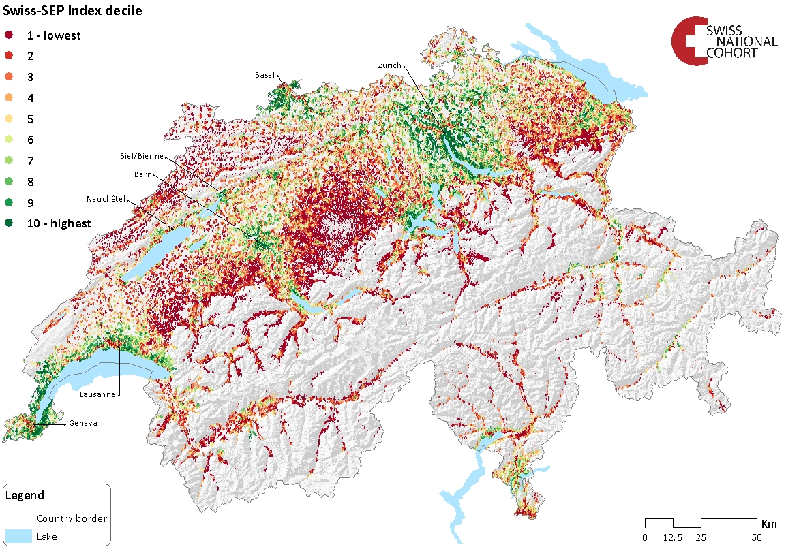

## Original (1.0)

The [paper](https://pubmed.ncbi.nlm.nih.gov/22717282/) describing the first version of the index was published in 2012 as a part of my PhD. It presented novel methodology and its application to construct an area-based measure of socioeconomic position (SEP) in Switzerland. We used most comprehensive Census 2000 data available via Swiss National Cohort project to describe four domains of SEP of the area: education, employment, income and housing. We used principal components analysis to combine these measures across custom neighbourhood boundaries. Those in turn were built using geographic coordinates of virtually all residential buildings and road network connections between them. With 1.27 million geographical areas this is probably to this day the most accurate, national, area-based measure of SEP. 

## Update (2.0 & 3.0)

The original index is based on data collected over 20 years ago. We wanted to know if index can still be used and if it can be improved using newer data. We first created version 2.0 of the index with very similar methodology and newer data - 2012-2015 yearly micro censuses that replaced decennial census in Switzerland and updated road network model. We then used newer data from the Swiss Household Panel to check to validate it and more recent mortality data from the Swiss National Cohort to check if it is still associated with mortality. Finally we tested another idea of creating *hybrid* measure where we combined *old* index with *new* and updated it only for the buildings constructed more recently - the output of this exercise became the version of 3.0. Our explorations and the newly proposed index are described in our preprint [here](https://osf.io/r8hz7/) with supplementary materials available on [OSF](https://osf.io/ncw9s/). 

## Future (4.0)

It seems like the work on index is newer finished! The new micro census data arrive every year and newer or more data could be used to create index. These data could better capture current population and the buildings and dwellings they reside in. More up to date road network data becomes available too. The project could be made more transparent and reproducible by adopting open source solution for the road network connectivity and releasing code used to generate the outputs and intermediate data. We are currently working with Federal Statistical Office to get access to the newer batches of data and progress with yet another version of the index. New ideas and solutions are tracked on the project's [repository](https://github.com/RPanczak/SNC_Swiss-SEP4/). 

## Data access

Index is there to be used! Over hundred papers cited it with few dozens using it directly in various epidemiological research on life expectancy, environmental and lifestyle exposures, assisted suicide, cancer, HIV, amyotrophic lateral sclerosis, and randomised trials just to name the few. We are not able to release the index as an open dataset but acess to it can be easily obtained, free of charge for research purposes. Please see  [SNC](https://www.swissnationalcohort.ch/data-and-access/) and [BfS](https://www.bfs.admin.ch/bfs/en/home/statistics/population/surveys/snc.html) websites for more details on the access and do get in touch with us!  