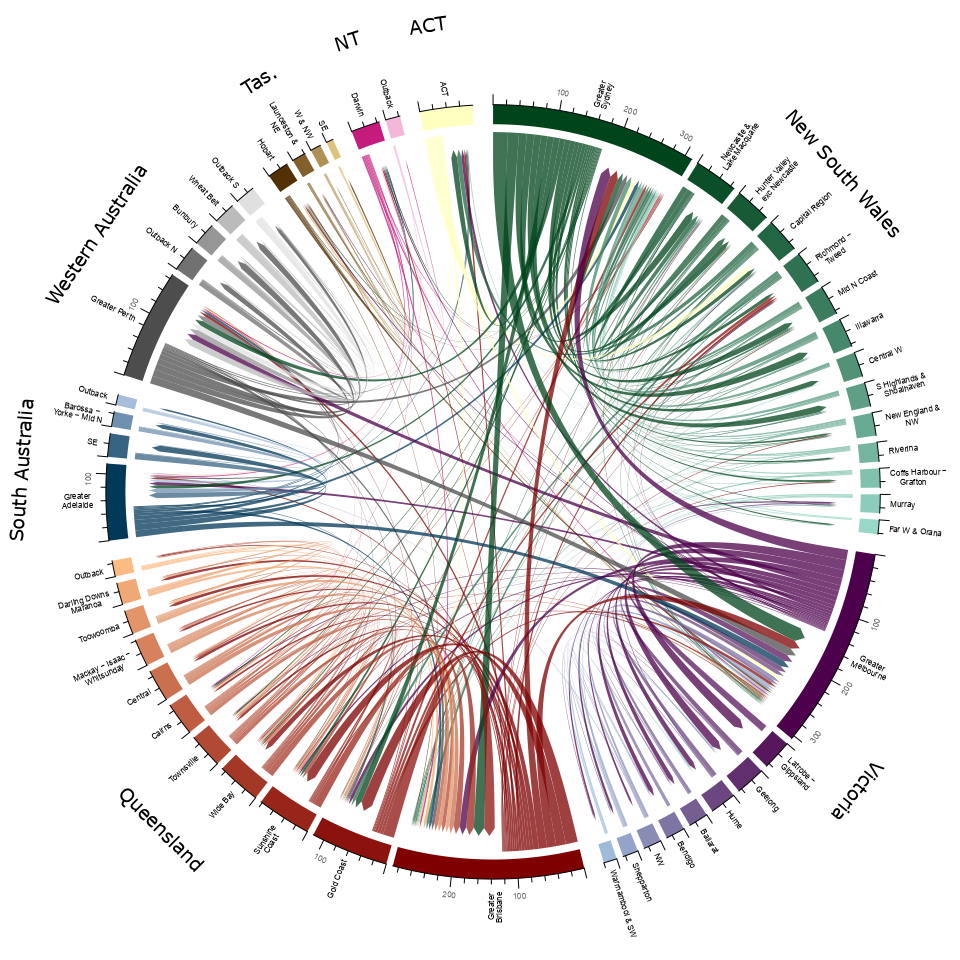
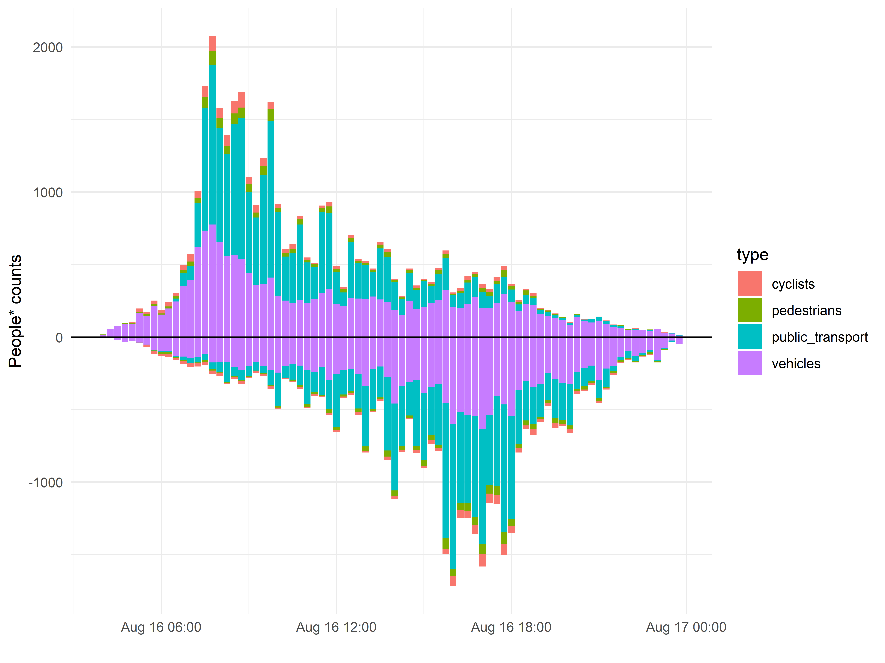
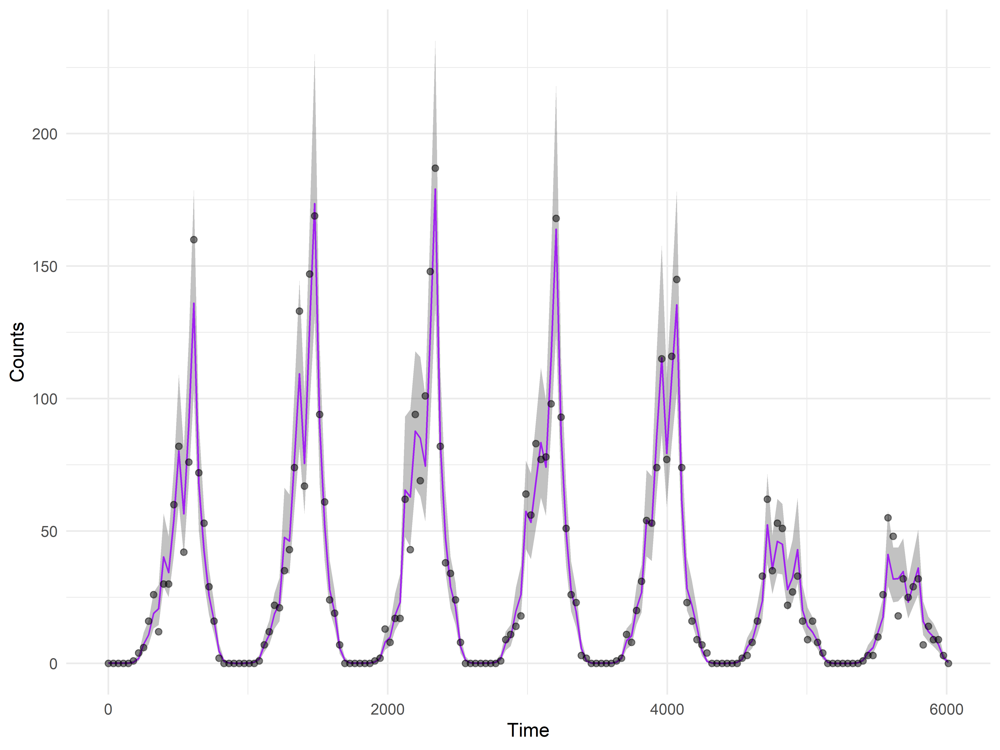
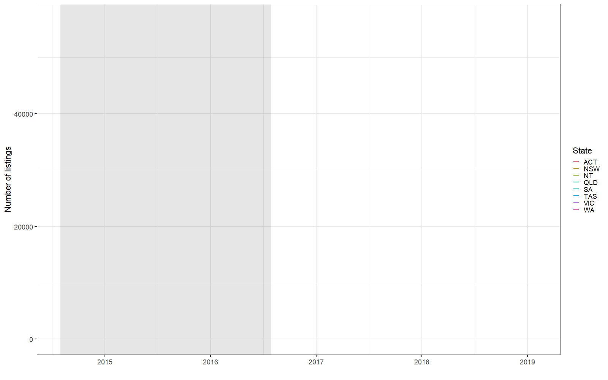

## About the project 

TEMPO acronym stands for *Techniques for Estimating MObile Populations* and refers to the the [project](https://sees.uq.edu.au/project/estimating-temporary-populations) led by Dr Elin Charles-Edwards and Professor Jonathan Corcoran at the Queensland Centre for Population Research. I worked as a research fellow for the project and contributed to few outputs, mostly focusing on the data and reproducibility side of things.  

## Completed components

### Elsewhere in Australia: a snapshot of temporary mobility on the night of the 2016 Census

First [paper](https://doi.org/10.37970/aps.v2i1.22) of the project looked at intensity, age and spatial patterns of Australian temporary movements captured at the 2016 Census. Building on the ideas and previous work of Martin Bell, we constructed and visualized origin–destination flows between *Place of Usual Residence* and *Place of Enumeration* and developed a classification of regions from the age profile of movers. Code and data of the paper are stored in this [repository](https://github.com/RPanczak/TEMPO_census-mobility).

### A Framework for Official Temporary Population Statistics
[Paper](https://doi.org/10.2478/jos-2020-0001) led by Elin that form theoretical backbone of the project.

### Systematic review of the literature

I led the effort to systematize the literature for the project - details can be found in *Systematic reviews and meta-analyses* section of projects and in this [repository](https://github.com/RPanczak/TEMPO_syst-rev).  

### Assessing the utility of Facebook in the 2019 flood in Townsville, Australia

The short [report](https://doi.org/10.37970/aps.v4i2.70) led by Chiu-San Chen (with invaluable data scraping contributions by Alexander Whitehead) showcased the use of the Facebook Ads data to visualize changes in temporary populations during the 2019 Townsville floods. 

### A data fusion approach to the estimation of temporary populations: An application to Australia

The final product of the project is an analysis led by Elin, Jonathan & Julia described in a [paper](https://doi.org/10.1371/journal.pone.0259377) detailing methodology and presenting its application to estimate Average Population Present in Australian regions combining mixture of novel (Airbnb) and traditional (visitor surveys) data sources. The code, data and supplementary materials of the project live on [OSF](https://osf.io/f2nhs/) and Julia's dashboard is available [here](https://qcpr.github.io/tempo/). 

## Experimental components

Not all the outputs of the project have been published and some ended their life as presentations or exploratory data analyses. Incomplete list of these includes: 

### Campus 24/7 

Temporal analysis of one week of population movements on St Lucia campus ([repository](https://github.com/RPanczak/TEMPO_pop247), [website](https://rpanczak.github.io/TEMPO_pop247/)).  

Using multiple sources of data:  

Example of *popularity* of Google Places predicting ferry terminal arrivals:  

Example of prediction of total stock of Wi-Fi users:  

### Australian Airbnb

Coming soon: spatiotemporal analysis of Airbnb (Airdna) data ([repository](https://github.com/RPanczak/TEMPO_Airbnb)).  

Looking at the spectacular growth of available properties:  

And trying to investigate relationship with rent on small area level:  

### Brisbane's road traffic

Coming soon: scrapping and visualizing ([repository](https://github.com/RPanczak/TEMPO_BCC-traffic))

<!--- ### Campus Wi-Fi --->

<!--- Visualizations and simple analyses of campus-wide Wi-Fi network ([repository](https://github.com/RPanczak/TEMPO_Wi-Fi)) --->
